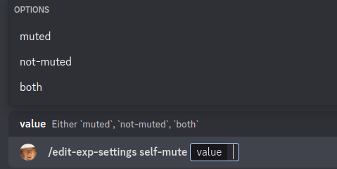
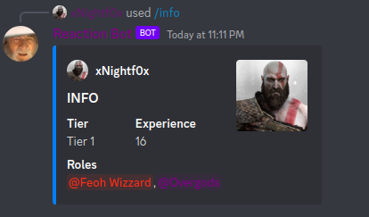

# exp-bot

Gaming in the past was quite different from what it is today. Back then, we would spend countless hours playing our "main" game, leveling our characters and improving our gear over the course of months. However, now there are numerous games, but they don't have the same longevity. What does remain is our friends and, perhaps, our shared Discord server. This Discord bot aims to recreate the leveling experience of an RPG.

## Table of Content
- [Features](#features)
- [Commands for local development](#commands-for-local-development)

## Features
The basic functionality allows for players to earn 1 experience point (exp) every minute when at least two people are in the same channel. This typically indicates that they are playing a game or engaging in a discussion together. Players have access to various slash commands that allow them to modify the exp conditions and receive information about their leveling progress.

At this point the only available commands are are for affecting the conditions, e.g muted people do not count as active,

    

or getting the info for a non-bot user.

    

## Commands for local development

### Setup development environment
- make env

### Setup the dev database.
- make db

### Run project on dev.
- make run_dev

### Run tests
- make tests

### Run linter
- make lint

